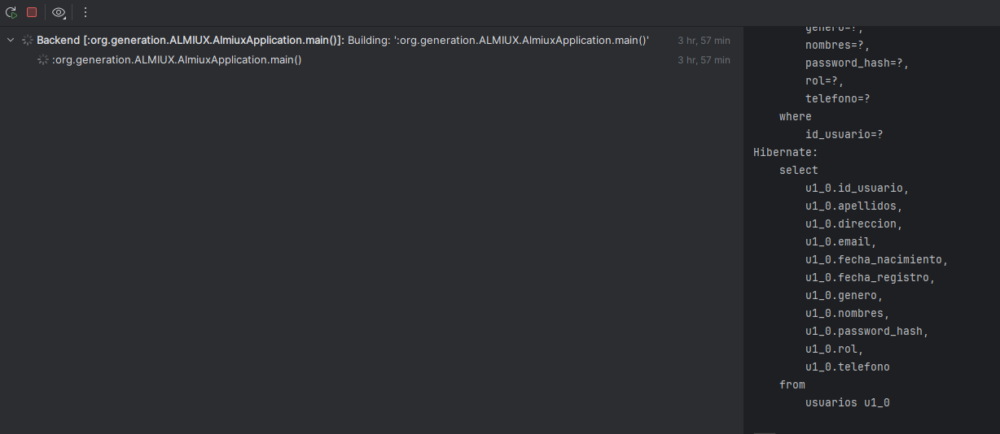
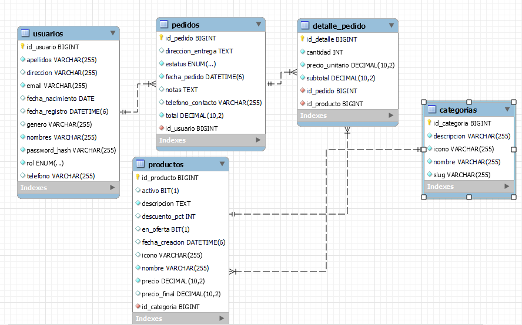
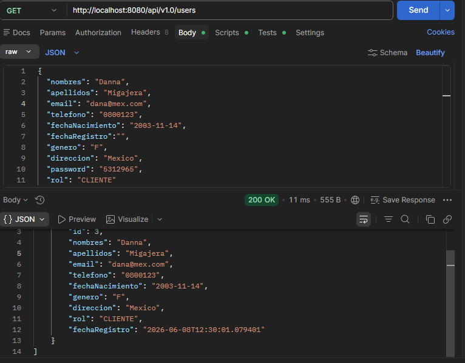

# ALMIUX Backend

API REST desarrollada con **Spring Boot 3** para la plataforma ALMIUX. Gestiona usuarios, productos, categorías, pedidos y sus detalles.

---

## Tecnologías

| Tecnología | Versión | Uso |
|---|---|---|
| Java | 17 | Lenguaje principal |
| Spring Boot | 3.5.14 | Framework base |
| Spring Data JPA | — | Acceso a base de datos |
| Spring Security | — | Encriptación de contraseñas (BCrypt) |
| Spring Validation | — | Validación de request bodies |
| MySQL | 8+ | Base de datos relacional |
| Hibernate | — | ORM (mapeado entidad ↔ tabla) |
| Gradle | 8+ | Gestión de dependencias y build |

---

## Requisitos previos

- Java 17 o superior
- MySQL 8 corriendo localmente
- Gradle (o usar el wrapper incluido `./gradlew`)

---

## Configuración (para cada integrante del equipo)

> `application.properties` está en `.gitignore` y **no se sube a GitHub** porque contiene contraseñas.
> Cada integrante debe crearlo localmente siguiendo estos pasos.

### 1. Crear la base de datos en MySQL

```sql
CREATE DATABASE almiux_db;
```

### 2. Crear tu archivo de configuración local

Copia la plantilla incluida en el repositorio y renómbrala:

```bash
# Mac / Linux
cp src/main/resources/application.properties.example src/main/resources/application.properties

# Windows (CMD)
copy src\main\resources\application.properties.example src\main\resources\application.properties
```

### 3. Editar con tus credenciales

Abre `src/main/resources/application.properties` y cambia estos dos valores:

```properties
spring.datasource.username=TU_USUARIO_MYSQL
spring.datasource.password=TU_CONTRASEÑA_MYSQL
```

> Si tu MySQL local no tiene contraseña (instalación por defecto), deja `password=` en blanco.

### 4. Levantar el servidor

```bash
./gradlew bootRun
```

El servidor inicia en `http://localhost:8080`.  
Las tablas se crean automáticamente gracias a `spring.jpa.hibernate.ddl-auto=update`.



---

## Archivos que NO se suben a GitHub

| Archivo | Razón |
|---|---|
| `application.properties` | Contiene credenciales de BD |
| `build/` | Archivos compilados generados localmente |
| `.idea/`, `.vscode/` | Configuración del editor de cada quien |
| `.DS_Store` | Archivo interno de macOS |

Todos están listados en `.gitignore`.

---

## Estructura del proyecto

- `config/` — Configuración de Spring Security y BCryptPasswordEncoder
- `controller/` — Endpoints de usuarios, productos, categorías, pedidos y detalles
- `exceptions/` — Manejo centralizado de errores HTTP y excepciones personalizadas
- `model/` — Entidades JPA: User, Product, Category, Order, OrderDetail
- `repository/` — Interfaces de acceso a base de datos
- `service/` — Lógica de negocio para cada entidad

---

## Diagrama Entidad-Relación



### Tablas y relaciones

| Tabla | Descripción | Relaciones |
|---|---|---|
| `usuarios` | Clientes y administradores | 1:N con `pedidos` |
| `categorias` | Grupos de productos | 1:N con `productos` |
| `productos` | Catálogo de productos | N:1 con `categorias` |
| `pedidos` | Órdenes de compra | N:1 con `usuarios`, 1:N con `detalle_pedido` |
| `detalle_pedido` | Productos dentro de un pedido | N:1 con `pedidos` y `productos` |

---

## Endpoints de la API

Base URL: `http://localhost:8080/api/v1.0`

### Usuarios `/users`

| Método | Endpoint | Descripción | Status |
|---|---|---|---|
| GET | `/users` | Obtener todos los usuarios | 200 |
| GET | `/users/{id}` | Obtener usuario por ID | 200 / 404 |
| GET | `/users/email?email=` | Obtener usuario por email | 200 / 404 |
| POST | `/users` | Crear nuevo usuario | 201 / 409 |
| PUT | `/users/{id}` | Actualizar usuario | 200 / 404 |
| DELETE | `/users/{id}` | Eliminar usuario | 204 / 404 |

**Ejemplo — crear usuario:**
```json
POST /api/v1.0/users
{
  "nombres": "Juan",
  "apellidos": "Pérez",
  "email": "juan@email.com",
  "password": "secreto123",
  "telefono": "5512345678",
  "genero": "M",
  "direccion": "Calle Falsa 123",
  "rol": "CLIENTE"
}
```



---

### Categorías `/category`

| Método | Endpoint | Descripción | Status |
|---|---|---|---|
| GET | `/category/categories` | Obtener todas las categorías | 200 |
| GET | `/category/{id}` | Obtener categoría por ID | 200 / 404 |
| POST | `/category` | Crear nueva categoría | 201 / 409 |
| PUT | `/category/{id}` | Actualizar categoría | 200 / 404 |
| DELETE | `/category/{id}` | Eliminar categoría | 204 / 404 |

**Ejemplo — crear categoría:**
```json
POST /api/v1.0/category
{
  "nombre": "Electrónica",
  "slug": "electronica",
  "icono": "laptop",
  "descripcion": "Dispositivos electrónicos y gadgets"
}
```

---

### Productos `/products`

| Método | Endpoint | Descripción | Status |
|---|---|---|---|
| GET | `/products` | Obtener todos los productos | 200 |
| GET | `/products/{id}` | Obtener producto por ID | 200 / 404 |
| POST | `/products` | Crear nuevo producto | 201 |
| PUT | `/products/{id}` | Actualizar producto | 200 / 404 |
| DELETE | `/products/{id}` | Eliminar producto | 204 / 404 |

**Ejemplo — crear producto:**
```json
POST /api/v1.0/products
{
  "categoria": { "id": 1 },
  "nombre": "Laptop Gamer",
  "descripcion": "Laptop para gaming de alto rendimiento",
  "icono": "laptop-icon.png",
  "precio": 25999.99,
  "enOferta": true,
  "descuentoPct": 10,
  "precioFinal": 23399.99,
  "activo": true
}
```

---

### Pedidos `/orders`

| Método | Endpoint | Descripción | Status |
|---|---|---|---|
| GET | `/orders` | Obtener todos los pedidos | 200 |
| GET | `/orders/{id}` | Obtener pedido por ID | 200 / 404 |
| POST | `/orders` | Crear nuevo pedido | 201 |
| PUT | `/orders/{id}` | Actualizar pedido | 200 / 404 |
| DELETE | `/orders/{id}` | Eliminar pedido | 204 / 404 |

**Valores válidos para `estatus`:** `PENDIENTE` · `EN_PROCESO` · `ENVIADO` · `ENTREGADO` · `CANCELADO`

**Ejemplo — crear pedido:**
```json
POST /api/v1.0/orders
{
  "user": { "id": 1 },
  "estatus": "PENDIENTE",
  "total": 23399.99,
  "direccionEntrega": "Calle Falsa 123",
  "telefonoContacto": "5512345678",
  "notas": "Dejar en recepción",
  "fechaPedido": "2026-06-08T10:00:00"
}
```

---

### Detalles de Pedido

| Método | Endpoint | Descripción | Status |
|---|---|---|---|
| GET | `/orders/{idPedido}/detalles` | Obtener detalles de un pedido | 200 |
| GET | `/detalles/{id}` | Obtener detalle por ID | 200 / 404 |
| POST | `/orders/{idPedido}/detalles` | Agregar detalle a un pedido | 201 |
| PUT | `/detalles/{id}` | Actualizar detalle | 200 / 404 |
| DELETE | `/detalles/{id}` | Eliminar detalle | 204 / 404 |

**Ejemplo — agregar detalle:**
```json
POST /api/v1.0/orders/1/detalles
{
  "order": { "idPedido": 1 },
  "product": { "id": 3 },
  "cantidad": 2,
  "precioUnitario": 23399.99,
  "subtotal": 46799.98
}
```

---

## Manejo de errores

Todos los errores devuelven respuestas JSON con el código HTTP correspondiente.

| Código | Cuándo ocurre |
|---|---|
| `400 Bad Request` | El body no pasa las validaciones (`@NotBlank`, `@Email`, etc.) |
| `404 Not Found` | El recurso solicitado no existe |
| `409 Conflict` | Se intenta crear un recurso con un dato único ya registrado |

**Ejemplo de error 400:**
```json
{
  "nombre": "El nombre del producto es obligatorio",
  "email": "Formato de email inválido"
}
```

**Ejemplo de error 404:**
Producto no encontrado con id: 99

---

## Roles de usuario

| Rol | Descripción |
|---|---|
| `CLIENTE` | Usuario regular que realiza compras |
| `ADMIN` | Administrador con acceso total al sistema |

---

## Notas de desarrollo

- **Contraseñas:** Se almacenan encriptadas con BCrypt. Nunca se devuelven en las respuestas (anotadas con `@JsonIgnore`).
- **CORS:** Actualmente configurado para aceptar cualquier origen (`*`). Restringir antes de pasar a producción.
- **`ddl-auto=update`:** Hibernate actualiza el esquema automáticamente. Cambiar a `validate` o `none` en producción.
- **Seguridad HTTP:** Actualmente todos los endpoints son públicos. Configurar autenticación JWT antes de producción.

---

## Equipo

**404 Team Not Found** · Generation México Bootcamp

| Integrante | Rol |
|---|---|
| **Kaleb Torres** | Developer · Scrum Master |
| **Danna Remigio** | Frontend Developer |
| **Arturo Ramírez** | Frontend Developer |
| **Yarilis Hernández** | Frontend Developer |
| **Zared Ortiz** | Backend Developer |
| **Noé Hernández** | QA Tester |
| **Diego Quiñónez** | Backend Developer |

---

*© 2026 · Abarrotes Almiux · Hecho en México con ❤️*  
*Proyecto académico — Generation México Bootcamp*
