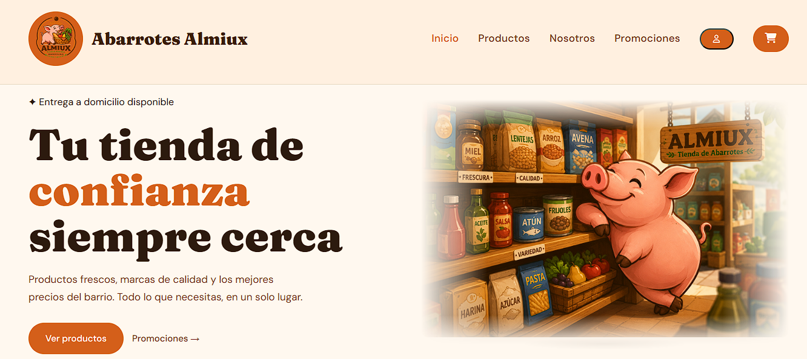
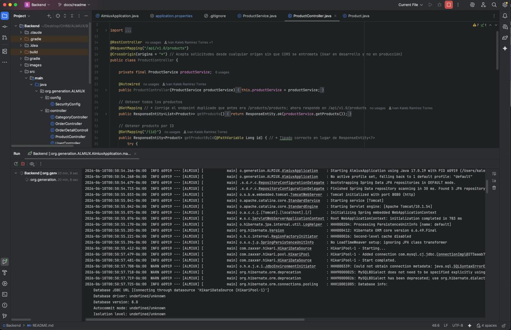
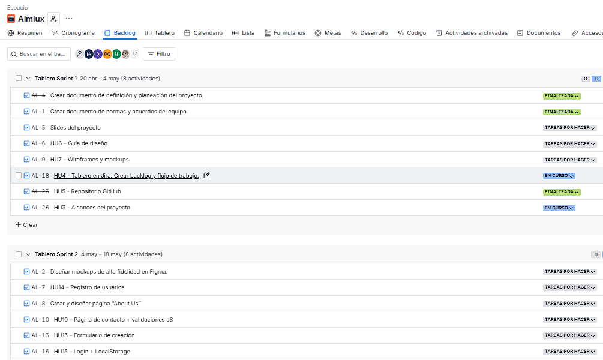
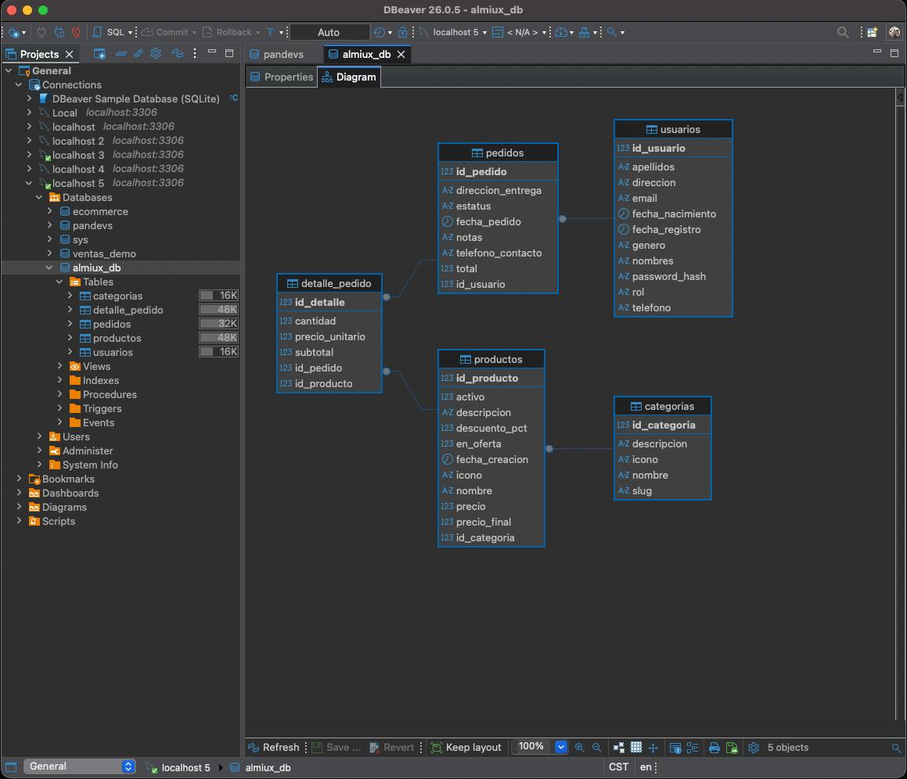

# 🏪 ALMIUX — Sistema de Gestión para Tienda de Abarrotes



> Proyecto desarrollado por el equipo **404 Team Not Found** como parte del Bootcamp Full Stack Java de Generation México.

---

# 📖 Descripción

ALMIUX es una plataforma web desarrollada para la administración y gestión de una tienda de abarrotes.

El proyecto integra un frontend responsivo para la interacción de los usuarios y un backend desarrollado con Spring Boot que expone una API REST para la gestión de información.

La plataforma permite administrar productos, usuarios y operaciones relacionadas con el negocio mediante una arquitectura cliente-servidor, facilitando la organización del inventario y mejorando la experiencia de los clientes.

---

# 🚀 Características Principales

## Frontend

* Diseño responsivo para dispositivos móviles, tablets y escritorio.
* Catálogo de productos organizado por categorías.
* Búsqueda y filtrado dinámico de productos.
* Registro de usuarios.
* Inicio de sesión.
* Página institucional con información del negocio.
* Panel administrativo para gestión de productos.
* Carrito de compras.
* Navegación intuitiva y amigable.

## Backend

* API REST desarrollada con Spring Boot.
* Arquitectura basada en capas.
* Persistencia de datos mediante JPA/Hibernate.
* Gestión de usuarios.
* Gestión de productos.
* Validación de datos.
* Integración con MySQL.
* Manejo de excepciones.
* Endpoints REST para operaciones CRUD.



---

# 🖼️ Capturas del Proyecto

## Página Principal


---

# 📋 Gestión del Proyecto

Durante el desarrollo se aplicaron metodologías ágiles para la organización, seguimiento y control de actividades.

## Tablero Jira



El equipo gestionó historias de usuario, backlog, tareas técnicas y seguimiento de sprints utilizando Jira como herramienta principal de trabajo.

---

# 🏗️ Arquitectura General

```text
Frontend (HTML, CSS, JavaScript)
            │
            ▼
     API REST Spring Boot
            │
            ▼
          MySQL
```

---

# 🛠️ Tecnologías Utilizadas

## Frontend

* HTML5
* CSS3
* JavaScript (ES6+)
* Bootstrap

## Backend

* Java
* Spring Boot
* Spring Data JPA
* Hibernate
* Maven

## Base de Datos

* MySQL

## Herramientas

* Git
* GitHub
* Jira
* Postman
* MySQL Workbench
* VS Code
* IntelliJ IDEA

---

# 📂 Estructura del Proyecto

```text
ALMIUX/
│
├── frontend/
│   ├── index.html
│   ├── productos.html
│   ├── nosotros.html
│   ├── login.html
│   ├── registro.html
│   ├── admin.html
│   ├── css/
│   ├── js/
│   └── images/
│
├── backend/
│   ├── src/main/java/
│   ├── src/main/resources/
│   ├── pom.xml
│   └── application.properties
│
└── README.md
```

---

# 🔌 API REST

## Usuarios

| Método | Endpoint       | Descripción                |
| ------ | -------------- | -------------------------- |
| GET    | `/users`       | Obtener todos los usuarios |
| GET    | `/users/{id}`  | Obtener usuario por ID     |
| GET    | `/users/email` | Buscar usuario por correo  |
| POST   | `/users`       | Crear usuario              |
| PUT    | `/users/{id}`  | Actualizar usuario         |
| DELETE | `/users/{id}`  | Eliminar usuario           |

---

## Productos

| Método | Endpoint         | Descripción             |
| ------ | ---------------- | ----------------------- |
| GET    | `/products`      | Obtener productos       |
| GET    | `/products/{id}` | Obtener producto por ID |
| POST   | `/products`      | Crear producto          |
| PUT    | `/products/{id}` | Actualizar producto     |
| DELETE | `/products/{id}` | Eliminar producto       |

---

# 🗄️ Base de Datos

El sistema utiliza MySQL para almacenar la información relacionada con usuarios, productos y demás recursos del sistema.



---

# ⚙️ Instalación y Configuración

## 1. Clonar el repositorio

```bash
git clone https://github.com/TU-USUARIO/ALMIUX.git
cd ALMIUX
```

---

## 2. Configurar MySQL

Crear la base de datos:

```sql
CREATE DATABASE almiux_db;
```

Configurar las credenciales en:

```properties
src/main/resources/application.properties
```

Ejemplo:

```properties
spring.datasource.url=jdbc:mysql://localhost:3306/almiux_db
spring.datasource.username=root
spring.datasource.password=tu_password

spring.jpa.hibernate.ddl-auto=update
spring.jpa.show-sql=true
```

---

## 3. Ejecutar el Backend

```bash
mvn clean install
mvn spring-boot:run
```

La API estará disponible en:

```text
http://localhost:8080
```

---

## 4. Ejecutar el Frontend

Abrir:

```text
index.html
```

o utilizar la extensión **Live Server** de VS Code.

---

# 📋 Funcionalidades

## Gestión de Usuarios

* Registro de usuarios.
* Consulta de usuarios.
* Actualización de información.
* Eliminación de registros.
* Validación de datos.

## Gestión de Productos

* Alta de productos.
* Consulta de productos.
* Actualización de productos.
* Eliminación de productos.
* Clasificación por categorías.

## Experiencia de Usuario

* Diseño responsivo.
* Navegación intuitiva.
* Formularios validados.
* Interfaz amigable.

---

# 👥 Equipo de Desarrollo

## 404 Team Not Found

| Integrante        | Rol                       |
| ----------------- | ------------------------  |
| Kaleb Torres      | Scrum Master · Developer  |
| Arturo Ramírez    | Frontend Developer        |
| Danna Remigio     | Frontend Developer        |
| Yarilis Hernández | Frontend Developer        |
| Zared Ortiz       | Backend Developer         |
| Noé Hernández     | QA Tester                 |
| Diego Quiñónez    | Backend Developer         |

---

# 🎓 Proyecto Académico

Proyecto desarrollado como parte del Bootcamp Full Stack Java de Generation México.

Durante el desarrollo se aplicaron conocimientos de:

* Desarrollo Frontend
* Desarrollo Backend
* APIs REST
* Bases de Datos Relacionales
* Metodologías Ágiles
* Control de Versiones con Git

---

# 📄 Licencia

Proyecto desarrollado con fines académicos y educativos.

---

## 🇲🇽 Hecho en México por el equipo 404 Team Not Found
